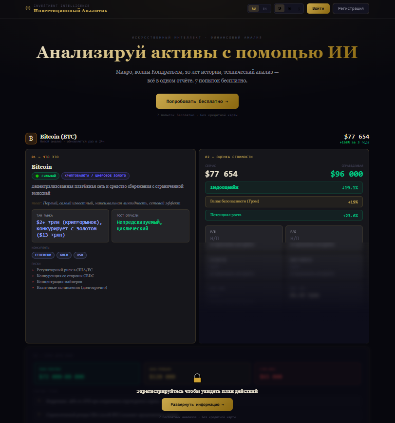
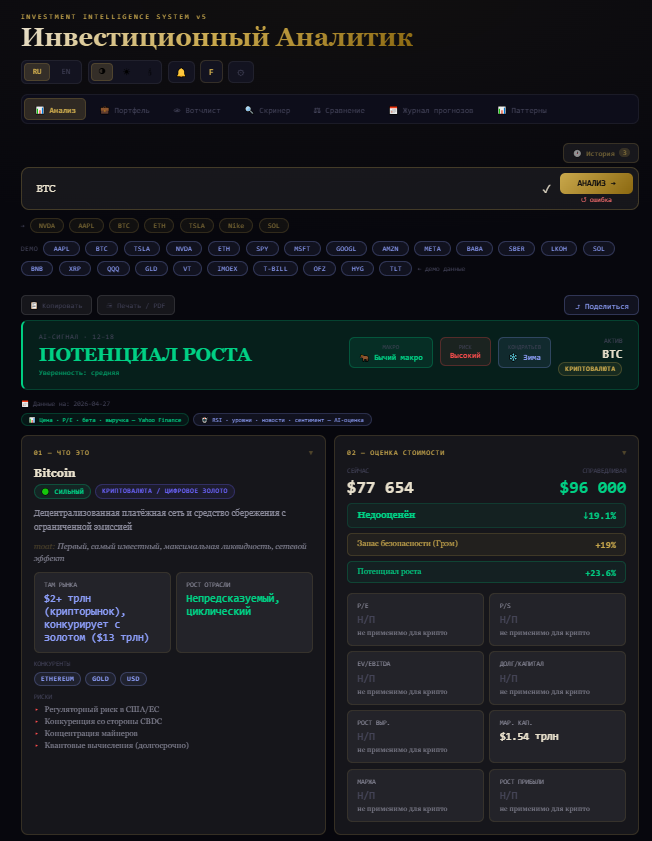
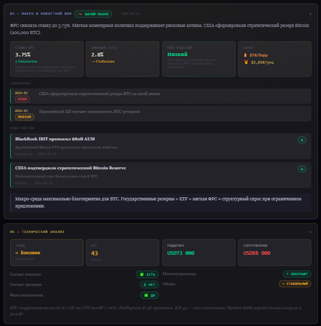
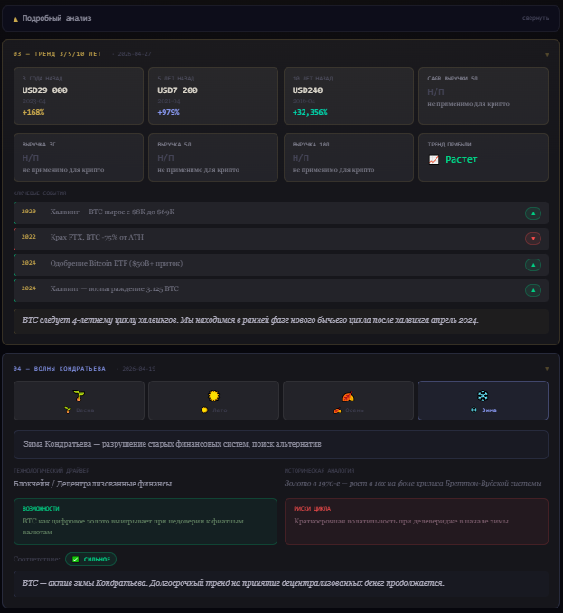
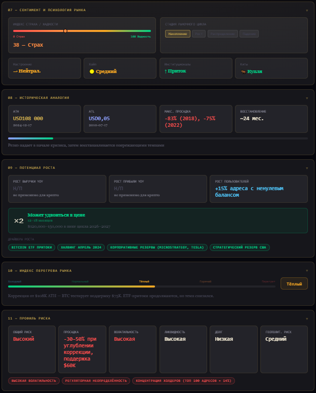
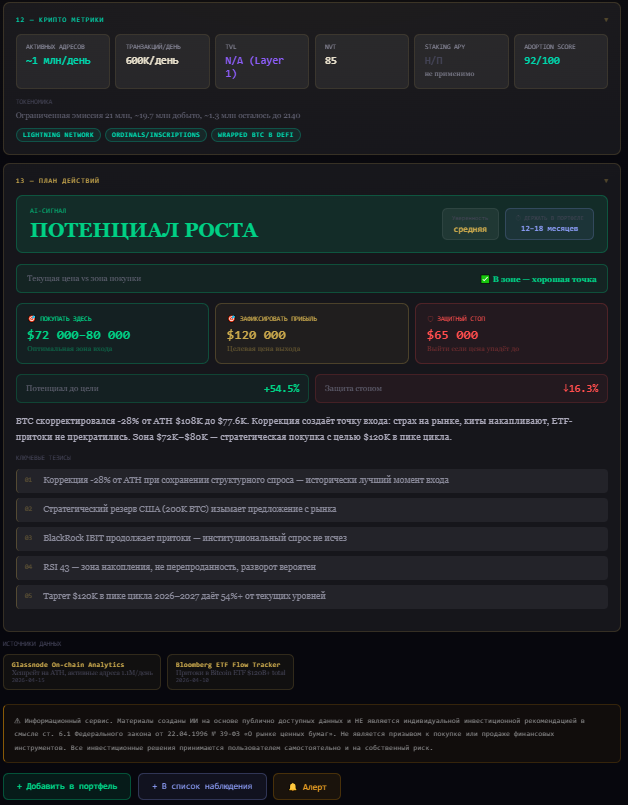
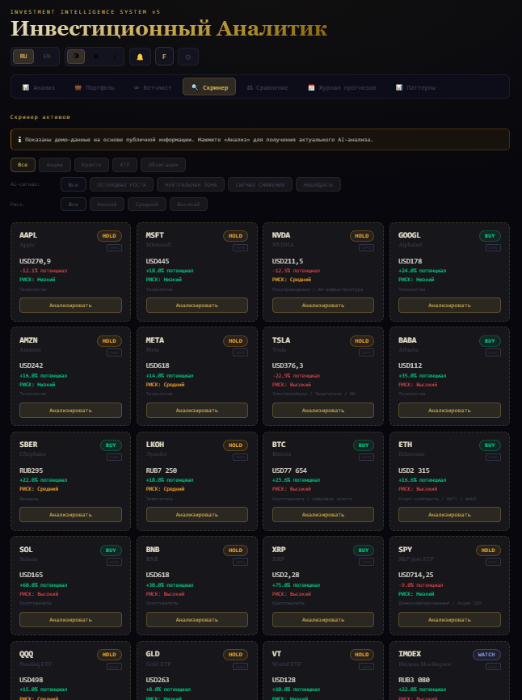
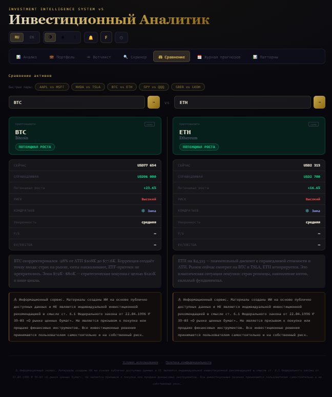
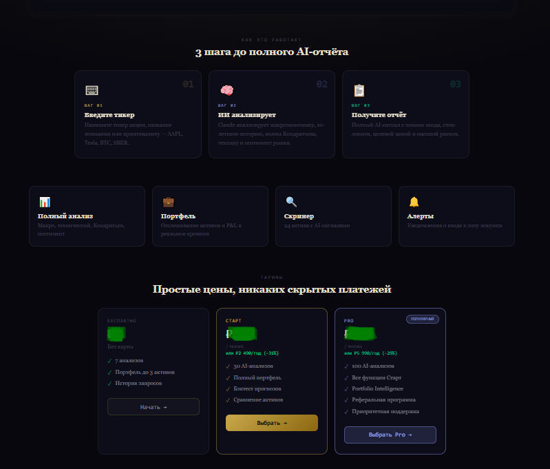

# AI Investment Analyst

> Full-stack AI-powered investment analysis platform for retail investors.  
> Real exchange data · Triple AI fallback · Russian market context · Subscription SaaS

**Built by Ярослав К.**

---

## Screenshots

### Landing Page


### Analysis — BTC (Position & Valuation)


### Technical Analysis — Real RSI, SMA, Pivot Points


### Macro & News Feed


### Kondratiev Waves + 10-Year Trend


### Sentiment · Risk Profile · Growth Potential


### Action Plan — Entry Zone, Target, Stop Loss


### Asset Screener — 20+ Assets with AI Signals


### Side-by-Side Comparison — BTC vs ETH


### Pricing


---

## What It Does

User enters a ticker symbol — `SBER`, `AAPL`, `BTC`, any market — and receives a structured 13-block analytical report in 10–20 seconds:

| Block | Content |
|-------|---------|
| 01 | Asset identity — sector, moat, market size, risks |
| 02 | Valuation — fair value, safety margin, upside potential |
| 03 | 3/5/10-year trend with key historical events |
| 04 | Kondratiev waves — long-cycle macro positioning |
| 05 | Macro & news — central bank rates, geopolitics, headlines |
| 06 | Technical analysis — RSI(14), SMA(50/200), Pivot S1/R1 |
| 07 | Sentiment — Fear & Greed, market cycle stage, flows |
| 08 | Historical analogy — ATH, ATL, max drawdown, recovery |
| 09 | Growth potential — catalysts, price targets |
| 10 | Market heat index — cold / warm / overheated |
| 11 | Risk profile — volatility, liquidity, geopolitical, debt |
| 12 | Crypto metrics — active addresses, NVT, TVL (crypto only) |
| 13 | Action plan — buy zone, target price, stop loss, key theses |

**Key differentiator:** Technical indicators (RSI, SMA, Pivot Points) are calculated from 260 real daily OHLC candles using deterministic algorithms — not generated by AI. Values are labeled `VERIFIED CALCULATED — NOT AI ESTIMATE` in the prompt and are verifiable on TradingView.

---

## Architecture

```
User enters ticker
        │
        ▼
   Data Router
        │
        ├── Russian equity → MOEX ISS API (official, free, no key)
        ├── US equity      → Yahoo Finance quoteSummary + chart
        ├── Crypto         → Binance 24hr + CoinGecko (fallback)
        └── Fallback       → Finnhub
        │
        ▼
   Technical Indicators (server-side, deterministic)
   RSI(14) · SMA(50) · SMA(200) · Pivot Points S1/R1
        │
        ▼
   Prompt with verified real-world data
        │
        ├── Primary    → Anthropic Claude Haiku 4.5
        ├── Fallback 1 → OpenAI GPT-4o (on 5xx / timeout)
        └── Fallback 2 → Mistral Small (on OpenAI failure)
        │
        ▼
   Structured JSON → React Frontend
```

Server-side cache: 24h TTL (Redis distributed / in-memory Map fallback).  
In-flight dedup: concurrent requests for the same ticker wait for the first response.  
Quota refund: atomic rollback via Supabase RPC on any upstream failure.

---

## Tech Stack

| Layer | Technology |
|-------|------------|
| Frontend | React 18 · TypeScript · Vite |
| Backend | Node.js (stateless proxy) |
| Database | Supabase (PostgreSQL + RLS + JWT) |
| Auth | Supabase Auth |
| AI Primary | Anthropic Claude Haiku 4.5 |
| AI Fallback 1 | OpenAI GPT-4o |
| AI Fallback 2 | Mistral Small |
| Data — RU | MOEX ISS API |
| Data — US | Yahoo Finance |
| Data — Crypto | Binance · CoinGecko |
| Data — Fallback | Finnhub |
| Payments — RU | YooKassa (full webhook integration) |
| Payments — Global | Stripe (roadmap) |
| Email | Resend |
| Notifications | Telegram Bot API |
| Rate Limiting | Redis sliding window (Lua script) |
| Cache | Redis / in-memory Map |
| Deploy | Railway / Render |

---

## Frontend Structure

```
src/
├── App.tsx
├── components/
│   ├── analysis/
│   │   ├── AnalysisView.tsx        # Main analysis screen
│   │   ├── ExportButtons.tsx       # PDF / copy export
│   │   └── sections/               # 13 analysis blocks
│   │       ├── ActionPlan.tsx      # Block 13 — entry zone, target, stop
│   │       ├── AssetInfo.tsx       # Block 01 — asset identity
│   │       ├── CryptoMetrics.tsx   # Block 12 — on-chain data
│   │       ├── Growth.tsx          # Block 09 — growth potential
│   │       ├── Historical.tsx      # Block 08 — historical analogy
│   │       ├── Kondratiev.tsx      # Block 04 — long-cycle macro
│   │       ├── MacroBackground.tsx # Block 05 — macro & news
│   │       ├── MarketHeat.tsx      # Block 10 — heat index
│   │       ├── RiskProfile.tsx     # Block 11 — risk profile
│   │       ├── Sentiment.tsx       # Block 07 — sentiment
│   │       ├── Sources.tsx         # Data sources transparency
│   │       ├── Technical.tsx       # Block 06 — RSI, SMA, pivots
│   │       ├── TrendAnalysis.tsx   # Block 03 — 3/5/10y trend
│   │       └── Valuation.tsx       # Block 02 — fair value
│   ├── portfolio/                  # Portfolio tracking + benchmark
│   ├── compare/                    # Side-by-side asset comparison
│   ├── screener/                   # Asset screener with AI signals
│   ├── backtest/                   # Prediction verification
│   ├── accuracy/                   # Public AI track record page
│   ├── modals/                     # Auth, payment, settings, consent
│   ├── layout/                     # Header, alerts bell, cookie banner
│   └── atoms/                      # Design system primitives
├── hooks/                          # 20+ custom React hooks
├── constants/                      # Translations, demo data, legal
├── contexts/                       # Currency, theme
├── utils/                          # API calls, formatting, validation
└── types/                          # TypeScript interfaces
```

---

## Key Features

**Analysis**
- 13-block structured report per asset
- Real RSI(14) from 260 daily candles — Wilder's formula
- Golden Cross / Death Cross detection (SMA50 vs SMA200)
- Pivot Points support/resistance from last 20 trading days
- Fair value with safety margin and upside %

**Russian Market**
- MOEX ISS official API (no key required)
- CBR key rate vs dividend yield comparison
- OFZ / bank deposit benchmark in every RU analysis
- IIS-3 tax account and 13–15% capital gains context
- Sanctions risk (NRD/Euroclear) for affected assets

**Portfolio**
- P&L tracking per position
- S&P500 and BTC benchmark (BenchmarkWidget)
- Auto-backtest: predictions verified vs real prices after 30 days
- Trade journal

**Alerts & Notifications**
- Price alerts via email + Telegram bot
- Weekly P&L digest (Monday, distributed Redis lock)
- Telegram: `/start` `/link CODE` `/alerts` `/remove TICKER`

**Platform**
- Public AI accuracy page `/accuracy` — every prediction logged and verified
- Share analysis via link with OG preview in Telegram/X (30-day TTL)
- Asset screener — 20+ assets with AI signals
- Side-by-side comparison of 2–3 assets
- Developer API with key management and per-key quota
- Referral program (+3 analyses for both parties)
- Bilingual — Russian and English

---

## Business Model

| Plan | Price | Analyses/mo | Gross Margin |
|------|-------|-------------|--------------|
| Free | ₽0 | 7 | — |
| Start | ₽299/mo | 30 | ~93% |
| Pro | ₽699/mo | 100 | ~99% |
| Annual Start | ₽2 490/yr | 30/mo | — |
| Annual Pro | ₽5 990/yr | 100/mo | — |
| Developer API | pay-per-use | by quota | — |

LLM cost per analysis: ~₽0.07 (Claude Haiku 4.5).

---

## Security

- JWT HS256 with timing-safe compare — no third-party auth library
- YooKassa webhook: IP allowlist + independent re-verification via `GET /v3/payments/{id}`
- Redis sliding-window rate limiting via atomic Lua script
- Distributed cron locks via Redis NX flag
- Atomic quota management — refund RPC on upstream failure
- `res.on('error', reject)` on all HTTP response handlers
- CSP · HSTS · X-Frame-Options · X-Content-Type-Options in production
- 64KB request / 256KB response body limits
- Path traversal prevention on static file serving

---

## Setup

### Prerequisites
- Node.js 18+
- Supabase project
- Anthropic API key

### Install

```bash
git clone https://github.com/yourusername/ai-investment-analyst
cd ai-investment-analyst
npm install
```

### Configure

```bash
cp .env.example .env
# Fill in required variables
```

### Run

```bash
# Development
npm run dev    # Vite frontend — http://localhost:5173
node proxy.js  # Backend proxy — http://localhost:3001

# Production
npm run build
npm start
```

---

## Environment Variables

See [`.env.example`](.env.example) for the full list.

**Required:**
```
ANTHROPIC_API_KEY
SUPABASE_URL
SUPABASE_ANON_KEY
SUPABASE_JWT_SECRET
```

**Optional (recommended for production):**
```
REDIS_URL           — distributed rate limiting and cache
OPENAI_API_KEY      — AI fallback 1
MISTRAL_API_KEY     — AI fallback 2
RESEND_API_KEY      — email delivery
TG_BOT_TOKEN        — Telegram notifications
YOOKASSA_SHOP_ID    — RU payments
YOOKASSA_SECRET_KEY — RU payments
ALLOWED_ORIGIN      — CORS (production domain)
```

---

## Legal

All analyses are informational only and do not constitute individual investment advice under Article 6.1 of Federal Law No. 39-FZ "On the Securities Market". Past analytical patterns do not guarantee future results. All investment decisions are made by the user independently and at their own risk.

---

## Author

**Ярослав К.**  
Built with [Claude](https://anthropic.com) as AI pair programmer.

---

*v5.0 · May 2026*
